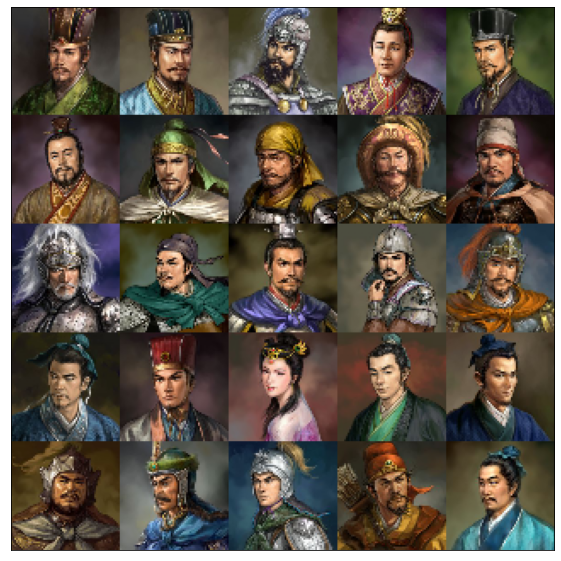
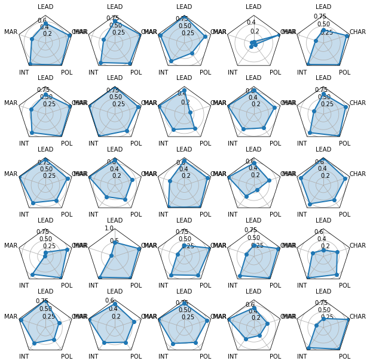
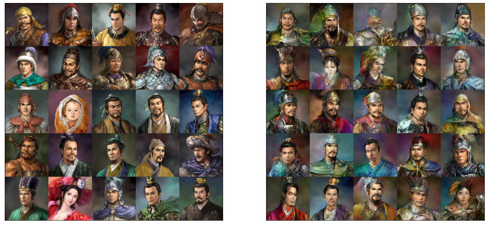
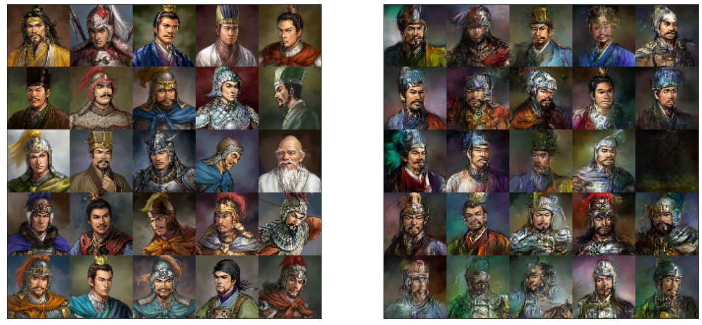
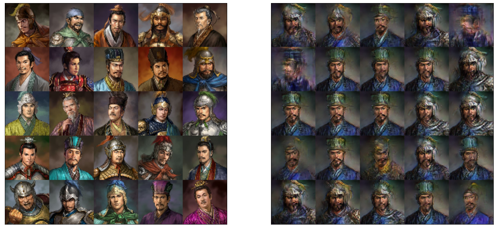
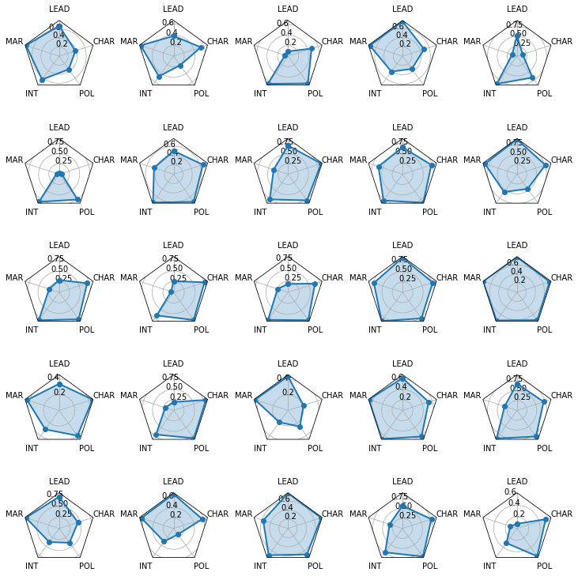
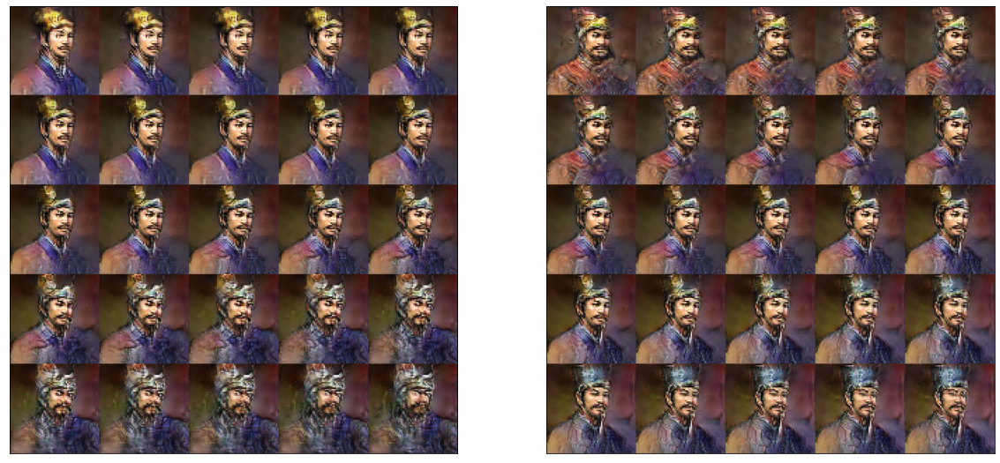
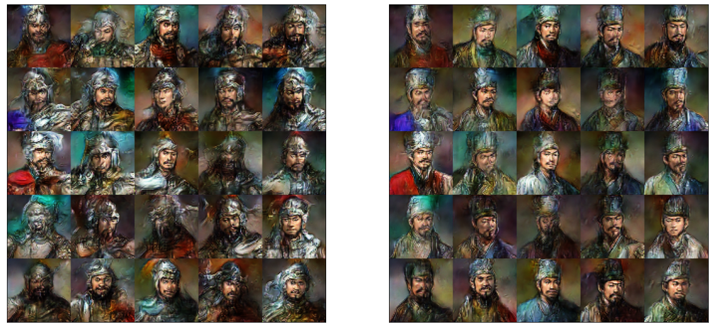
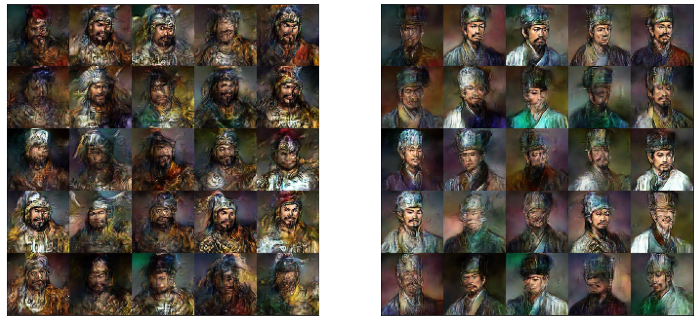

# SanGuoGAN

三國志11 Character profile generator via Conditional Wasserstein Generative Adversarial Networks (cWGAN).

## Data and model
This toy project is a cWGAN implementation trained on 721 character profile artworks by 三國志11 (property of Koei Co., Ltd.). The artworks are stylishly similar and do a good job of demonstrating the power of deep generative learning. The image data are collected from the game directly and compressed to size 64x64 and the character stats data are obtained from a summary table made by cws0324@yahoo.com.tw. This was originally my class project for CSE599i Generative Models at UW, instructed by John Thickstun. The gradient penalty part is in fact written by John. The idea is partly inspired by [girl.moe](https://make.girls.moe/#/)

To process the data, I match images with in-game character stats (Leadership 统帅, Martial Arts(War) 武力, Intelligence 智力, Politics 政治, and Charisma 魅力) by the character’s Chinese name. Note that some characters have multiple artworks (young and old), but the stats are the same (except for 吕蒙, sorry), and there are two 马忠, one works for 吴 and one for 蜀. We visualize a random batch of images and stats below. (The beautiful Radar plot code is from [This post](https://www.kaggle.com/typewind/draw-a-radar-chart-with-python-in-a-simple-way) and [This document](https://matplotlib.org/3.1.1/gallery/specialty_plots/radar_chart.html).)

  
   

The model architecture is based on the WGAN paper  [WGAN](https://arxiv.org/abs/1701.07875). The generator is (128-dimension latent vector) &rarrtl; embedding: fully-connected layer and reshape into 3 channel 16x16 &rarrtl; 9 ResNet blocks: w/ 3x3 ConV + BN &rarrtl; Trilinear upsample, then 3x3 ConV and BN &rarrtl; pool and output image; And the discriminator (critic) is 64x64 images &rarrtl; embedding: 3x3 Conv and ReLu &rarrtl; 3 ResNet blocks: w/ 3x3 ConV &rarrtl; sum and output. The WGAN loss is regularized by a gradient penalty [Gradient Penalty](https://arxiv.org/abs/1704.00028). 

In the cWGAN architecture, I used the character stats (LEAD, MAR, INT, POL, CHAR) and an additional SEX covariance as input together with the latent noise. The idea of conditioning is from [Conditional GAN](https://arxiv.org/pdf/1411.1784.pdf). In both the generator and the discriminator, the additional covariates are fed into a dense linear layer and transformed into an additional channel of the image, and combined with the actual image/noise by a convolution. 

## Results

Without the conditioning implementation, the WGAN generated artworks already look quite promising. In the figures below, left panels are real artworks, and right panels are generated artworks. (no conditional happened here).

  

Below are results from the cWGAN model. In the plot below, the left panel shows some real artworks, and the right panel shows generated samples conditioned on the same stats. Note the apparent difference between civil (文官) and military (武将) officials. The most siginificant features the model learned are
- Headgears: hat vs helmet
- Clothing: metal armour vs cross-collar civil clothing  
- Beard styles: trimmed vs long

Also note that the model generates higher quality artworks for underlying stats that looks reasonable amongst the 721 training samples. For example, the following stats-build generates good artworks 曹仁(3rd col, 2nd row) 牵招(1st col, 4th row), 留赞 (4th col, 3rd row) 马忠（吴国）(3rd col, 4th row). Due to the small training size, the model performs poorly for rare stats-builds, for example, 于吉 (5th col, 3rd row) who has LEAD=12, MAR=6 and CHAR =95. 

  

Now we fix some randomly-generated noise and use different stats from real characters as input to the generator. The plot below demonstrates how well the model learned to map these stats into artworks. The left panel are real artworks and the right panel are generated artworks conditioned on the same stats. Below are radar graph of the stats. 

  

  

Next, we fix some randomly-generated noise and use some artificial stats as input. In the left panel, we set INT=POL=CHAR=50 and vary LEAD=MAR in the range of (0,100). The plot shows the gradual change from civial to military artwork. In the right panel, we set LEAD=MAR=CHAR=50 and vary INT=POL in the range of (0,100). The plot shows the gradual change from military to civial artwork. Note the subtle change of face from civil to military (narrow &rarr; wide), headgear (hat &rarr; helmet), beard (trimmed &rarr; full-beard), and clothing (cotton &rarr; armour).

  

Lastly, just for fan, we generate multiple images with the stats of 关羽 and 诸葛亮!

  

Also, 吕布 vs 郭嘉

  

