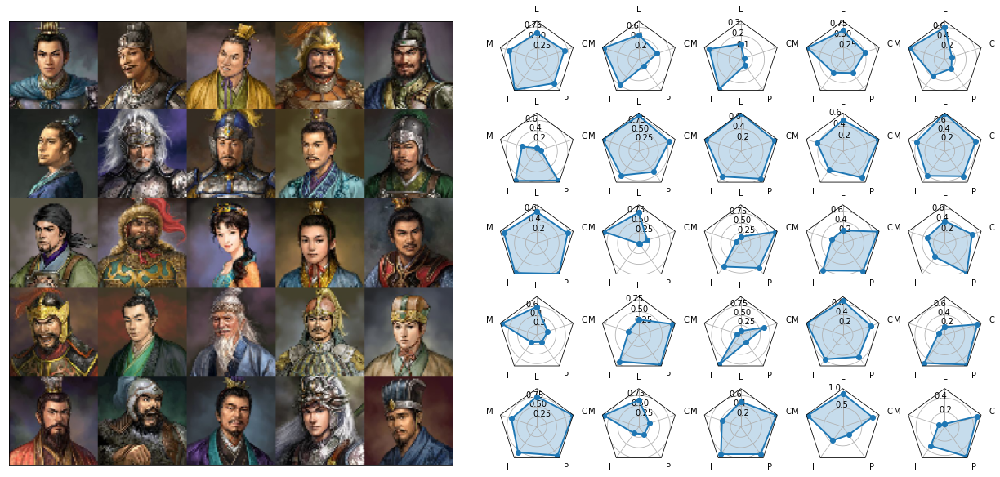

# SanGuoGAN

三國志11 Character profile generator via Conditional Wasserstein Generative Adversarial Networks (cWGAN).

This toy project is a cWGAN implementation trained on 790 character profile artworks by 三國志11 (property of Koei Co., Ltd.). The artworks are stylishly similar and can demonstrate the power of deep generative learning. The code implementation is originally from a class project for CSE599i Generative Models in UW, instructed by John Thickstun. A majority of code is in fact written by John for one homework problem on GAN. The image data are collected from the game directly and compressed to size 64x64, and the character stats data are obtain from the summary table made by cws0324@yahoo.com.tw. 

To cleanse the data, we match images with character stats (Leadership, Martial Arts(War), Intelligence, Politics, and Charisma) by the character’s Chinese name. Note that some characters have multiple artworks (young and old), but the stats are the same (sorry 吕蒙). We visualize a random batch of images and stats below. 

The model architecture follows directly from CSE599i’s course homework, which is based on the WGAN paper  [WGAN](https://arxiv.org/abs/1701.07875) and gradient penalty [Gradient Penalty](https://arxiv.org/abs/1704.00028). Without the conditioning step, the WGAN generated Sanguo artworks already look quite promising. In the figures below, left panels are real artworks, and right panels are generated artworks. 

In the cWGAN architecture, I used the character stats (LEAD, MAR, INT, POL, CHAR) and an additional SEX covariance as input together with the latent noise. The idea of conditioning is from [Conditional GAN](https://arxiv.org/pdf/1411.1784.pdf). In both the generator and the discriminator, the additional covariates are fed into a dense linear layer and transformed into an additional channel of the image, and combined with the image in the convolution step. 

_to be continued_
