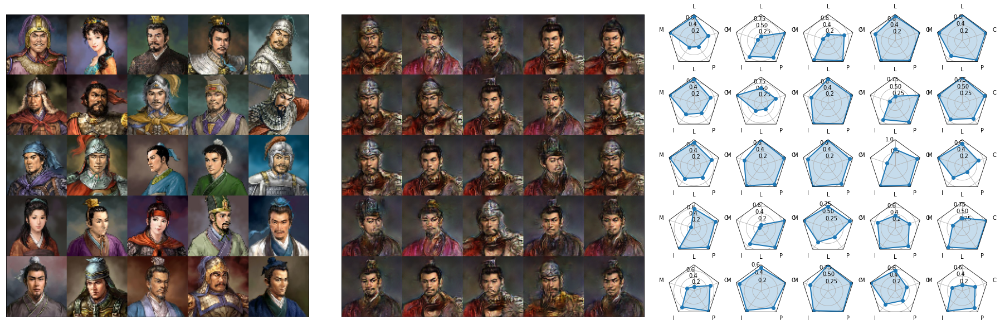

# SanGuoGAN

三國志11 Character profile generator via Conditional Wasserstein Generative Adversarial Networks (cWGAN).

## Background

__History__:
The Three Kingdoms (three kingdoms: Wei 魏, Shu 蜀, Wu 吴) era (roughly 189AD to 263AD) is an eventful and important period of Chinese history, known for the great battles, as well as famous warlords, generals and counselors.The abundant stories about Three Kingdoms era is recorded in the historical book, _Records of the Three Kingdoms_ by  Chen Shou 陈寿 in the 3rd Century, and inspired the novel _Romance of the Three Kingdoms_ by Luo Guanzhong 罗贯中 in the 14th Century, which later becomes one of the most famous piece of Chinese literature. The historical figures of this era includes leaders of farmers' revolution 农民起义领袖, government officials 朝臣, regional warlords 地方军阀, fighters 战士, advisors 谋士, counselors 军师,  eunuchs 宦官, politicians 论客,  poets 诗人, religious leaders 宗教领袖  --- and often times they take more than one of the above roles. 
	
__ROTK, the Games__:
Romance of the Three Kingdoms 三國志 (referred to as ROTK to avoid confusion with the name of the novel) is a series of turn-based tactical role-playing simulation grand strategy wargames developed by the Japanese company KOEI, with the first one out in 1985. 
	
__The Artwork Data Set__:
The game employed a  studio dedicated to creating portrait artworks for almost all the historical figures in the era. These artworks are beautiful and consistent in style. When ROTK11 三國志11 (property of Koei Co., Ltd.) came out in 2006, there are 790 profile artworks included in the game, in the same oil-painting style and with similar lighting, pose and background. Most characters are portrait as military general (with armor and helmet, and sturdy body) or civil official (with high hat and cotton/silk clothing, and weaker body), according to their history.  Due to the history of male-dominant power-relation and narrative, there are very few (<50) female character included. 
	
	
__The Character Stats Data Set__:
Characters in ROTK11 are numerically characterized by their leadership abilities, martial/melee prowess, intellects, political prowess, and charisma. The first two represents the character's ability in war affairs,and the latter three represent the ability in civil and internal affairs. Typical military generals have high leadership and martial prowess, with maybe low politics and intellects. Typical civil officials and counselors have high intellectsand politics, with usually low martial prowess. There are also historical figures who ranks high on all these measures, and of course, people who ranks low on all stats. The stats data is collected and summarized by cws0324@yahoo.com.tw. 

__The Project__:
This was originally my class project for CSE599i Generative Models at UW, instructed by John Thickstun. The gradient penalty part is in fact written by John. The idea is partly inspired by [girl.moe](https://make.girls.moe/#/)

## Data processing and cWGAN Model
To process the data, I match images with in-game character stats (Leadership 统帅, Martial Arts(War) 武力, Intelligence 智力, Politics 政治, and Charisma 魅力) by the character’s Chinese name. Note that some characters have multiple artworks (young and old), but the stats are the same (except for 吕蒙, sorry), and there are two 马忠, one works for 吴 and one for 蜀. There are 721 images left. This makes our training data. The images are down-sampled into 64x64 size, which is big enough to see the characters and small enough to train on a personal computer. The stats are scaled down to the range (0,1), and the sex of the character is recorded as a {0,1} indicator variable. We visualize a random batch of images and stats below. (The beautiful Radar plot code is from [This post](https://www.kaggle.com/typewind/draw-a-radar-chart-with-python-in-a-simple-way) and [This document](https://matplotlib.org/3.1.1/gallery/specialty_plots/radar_chart.html)) 

I built two models, one unconditional WGAN and one conditional WGAN. The architectures are shown below. The model architecture is based on the WGAN paper  [WGAN](https://arxiv.org/abs/1701.07875).The WGAN loss is regularized by a gradient penalty [Gradient Penalty](https://arxiv.org/abs/1704.00028). This part of code is implemented by John. In the cWGAN architecture, I used the character stats (LEAD, MAR, INT, POL, CHAR) and an additional SEX covariance as input together with the latent noise. The idea of conditioning is from [Conditional GAN](https://arxiv.org/pdf/1411.1784.pdf). In both the generator and the discriminator, the additional covariates are fed into a dense linear layer and transformed into an additional channel of the image, and combined with image/noise by the later convolution steps. This is different from the original cWGAN, in which the conditioned variables are one-hot embedding of categories. Note that the generator and discriminator shares the same Stats input from the sample batch. I hope that by linking the conditioned stats to an additional channel,  the model can learn some stats-related features. (Turns out it does learn that. Cheers.)

I train the models (WGAN and cWGAN) with the standard ADAM with batch size 40 and learning rate 3x10e4 for the first 200 epochs and 3x10e5 for the rest. The models are trained on Google Colab  with a GPU core for 400 (WGAN) and 800 (cWGAN) epochs. The unconditional model is arguably easier to train due to the smaller number of parameters. The cWGAN has 21,205,121 parameters in the generator and 6,688,257 in the discriminator/critic.

## Results

### Unconditional GAN
Without the conditioning implementation, the WGAN generated artworks already look quite promising. In the figures below, left panels are real artworks, and right panels are generated artworks. Note how the model learns to paint (or rather, copy-paste?) hats, helmets, armor and beards and piece them together to form a new face. The model also picked up how to paint the background with the blurry color clouds.  A few of the generated faces are actually very realistic (for example, (2nd row,4th col), (3,1), (3,3), (4,4),(5,3)). The helmet generated in (4,5) looks like the one from (5,3) on the left. A few examples are generated faceless, (for example, (1,3))

### Conditional-WGAN
Now we show the results from the conditional model.
#### Random outputs
The left panel is real artworks,  the right panel are the radar graph of the character stats, and the middle is generated by cWGAN conditioned on the these character stats. Note the apparent difference between civil (文官) and military (武将) officials. The most siginificant features the model learned are: 
- Headgears: hat vs helmet
- Clothing: metal armour vs cross-collar civil clothing  
- Beard styles: trimmed vs long

It is obvious that most military character stats-packages generates military-general-looking faces, noticeably with helmet and armor (for example, in top batch, (1,1) 马岱, (1,5) 吕蒙, (2,3) 甘宁, (3,1) 鲍隆, (5,3) 刘封. in bottom batch, (5,2) 廖化, (4,3) 曹性). On the other hand, civil officials stats-packages obviously generates civil looking faces, noticeably with small high hat, and soft clothing (for example, in top batch, (2,1) 陈宫, (5,1) 刘岱; bottom batch, (1,3) 荀彧, (4,3) 曹丕). One noticeable behavior of the model is that it can't really generate female faces. For example, in top batch, (4,2) 张春华 and (4,4) 樊氏 both corresponds with faceless pictures; in bottom batch (3,5) 貂蝉 and (5,4) 蔡文姬 both corresponds to civil official looks, due to their similar stats. 

#### Conditioning
Next we demonstrate the behavior of the generator with same input noise and varying  stats.  In left panel, Intelligence, Politics and Charisma are fixed at 50, while Leadership  and Martial Arts increases from 0 to 100. In right panel, Leadership, Martial Arts and Charisma are fixed at 50, while Intelligence  and  Politics increases from 0 to 100. We see clearly that as the military-related stats (Leadership and Martial Art) increases, the generated face becomes more muscular, the hat changes into helmet, and the cloth changes into armor. On the other hand, when counselor-related stats (Intelligence and Politics) increases, the generated face softens, the helmet changes into hat, and the armor changes into cross-collar cotton dress. 

Next, we show the effect of charisma. In the left panel, we hold all stats fixed and increase Charisma from 0 to 100. The model seems to have some vague idea about charisma (shave your beard makes you more charismatic?) In the right panel, we increase all stats equally from 0 to 100. The quality of generated low stats-characters are rather bad --- mainly due to the lack of samples. 

I also tried different stat-profiles from real characters below. There are some interesting contrasts: I noticed that the military generals (1,4) and (1,5) are quite different from (5,4) and (5,5) --- the former two are smart (high intelligence and politics) and the latter two are rather dense.

#### Conditional Distribution
We demonstrate the expressiveness of conditional distribution by generating varies artworks given the same stats and different noises. The idea is to showcase that the model is actually generating stuff rather than just saving a few pieces here and there. We plot 25 关羽 (Stats LEAD=95, MAT=97, INT=75, POL=62, CHAR=93), and 25 诸葛亮 (Stats LEAD=92, MAT=38, INT=100, POL=95, CHAR=92).This is shown below.

Also, 吕布 vs 郭嘉: 

## Summary
In summary, the model is quite successful in learning key features of historical figures given such a small training set size. It successfully learned the importance of head gear, clothing, beards, and some facial expressions to characterizeeither a tough military leader, or a smart counselor.  We can show that the model actually learned something about the conditional distribution (see the expressive output) and gained some ability to generalize (see the interpolation example). 
	
Since the samples unevenly covers the space of all character stats, some stats (when being conditioned on) can generate better results then others. This is due to the bad distribution of stats. As a result, interpolation on stats is hard, though not impossible.
	
I think this is as much juice as we can get from this data set with only 721 images. 

## Thanks

Thanks [John](https://homes.cs.washington.edu/~thickstn/) for making this project possible. 
